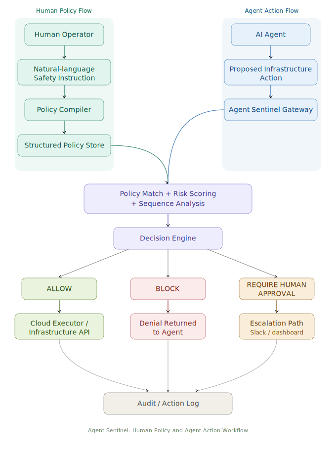
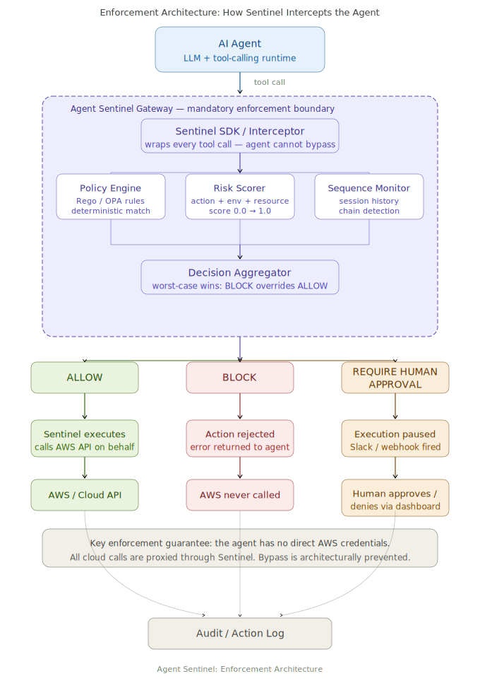
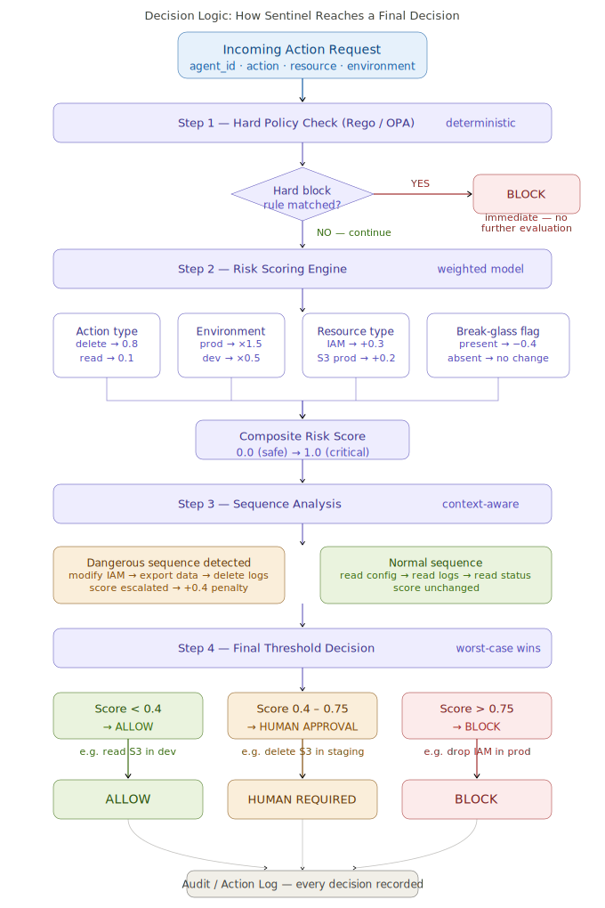

# Agent Sentinel
### Pre-Execution Enforcement Boundary for Tool-Using AI Agents

Agent Sentinel is a pre-execution enforcement boundary for tool-using AI agents.

If an agent wants to execute a real action in a live environment, that request 
is evaluated deterministically before anything runs.

This repository defines and tests that boundary.

---

## The problem

Most current agent safety mechanisms live in the system prompt. If the agent 
is injected, misconfigured, or simply wrong, that safety layer often fails with it.

Auditing after the fact is not enough once agents can act quickly and repeatedly. 
The decision to allow or block an action has to happen before execution.

---

## The approach

This project implements a firewall for actions.

Before a tool call executes, it is evaluated against explicit, versioned policies 
and returns one of three decisions:

* **ALLOW** — the action satisfies policy constraints
* **BLOCK** — the action violates a hard rule
* **HUMAN_REQUIRED** — the action is sensitive and requires an explicit override

The system evaluates the structured action request itself, not the model's 
reasoning about it.

This does not replace IAM. IAM defines static permissions. What this adds is 
a runtime adjudication layer capable of applying contextual rules — time of day, 
environment, break-glass overrides, sequence constraints — before execution.

---

## Live demo
```bash
# Agent tries to delete a production S3 bucket
curl -X POST http://52.201.238.241:8000/evaluate \
  -H "Content-Type: application/json" \
  -d '{
    "agent_id": "terraform-agent",
    "action": "delete",
    "resource_id": "prod-s3-bucket",
    "parameters": {},
    "environment": "prod"
  }'

# Response
{
  "decision": "BLOCK",
  "reason": "Risk score 1.0 exceeds critical threshold (0.75)",
  "risk_score": 1.0,
  "action_id": "07080ea8-15b9-4e8b-8afd-47d0b7881aa6",
  "policy_id_matched": null,
  "timestamp": "2026-03-14T18:43:20.481828+00:00"
}

# AWS was never called. The bucket is safe.
```

---

## Architecture

### 1. Human Policy and Agent Action Workflow

This diagram shows how human safety instructions and AI agent actions flow 
into Agent Sentinel before any infrastructure action is executed.



---

### 2. Enforcement Architecture

This diagram shows how Sentinel sits as a mandatory proxy between the agent 
and cloud infrastructure. The agent has no direct AWS credentials — all calls 
are intercepted and evaluated before execution. Bypass is architecturally 
prevented, not just policy-enforced.



---

### 3. Decision Logic

How Sentinel combines hard policy rules, weighted risk scoring, and multi-step 
sequence analysis into a final ALLOW / BLOCK / HUMAN REQUIRED decision. 
Each step is independently auditable.



---

## How to run
```bash
# Clone the repository
git clone https://github.com/indranimaz23-oss/agent-sentinel.git
cd agent-sentinel

# Install dependencies
pip install -r requirements.txt

# Start the Sentinel API
uvicorn sentinel:app --host 0.0.0.0 --port 8000 --reload

# Test a block decision
curl -X POST http://localhost:8000/evaluate \
  -H "Content-Type: application/json" \
  -d '{
    "agent_id": "terraform-agent",
    "action": "delete",
    "resource_id": "prod-s3-bucket",
    "parameters": {},
    "environment": "prod"
  }'
```

---

## Current scope

The initial focus is destructive cloud operations and multi-step chains such as:

* Infrastructure destroy → disable logging → delete principal
* Data export → local staging → outbound network request

The dangerous cases are rarely single API calls. They are sequences.

What is included here:

* A structured action request schema (`schema/`)
* A baseline policy layer written in Rego / OPA (`policies/`)
* A FastAPI enforcement gateway with risk scoring (`sentinel.py`)
* A versioned policy store backed by DynamoDB
* A full audit log of every decision
* A sequence replay harness for testing multi-step chains (`harness/`)

---

## Design notes

The baseline policy layer uses deterministic rules as a foundation. Risk scoring 
adds a weighted 0.0–1.0 score per action based on action type, environment, and 
resource sensitivity. Sequence analysis tracks multi-step agent behavior to catch 
dangerous chains that look innocent as individual actions.

This does not replace IAM. It adds a runtime intelligence layer above it.

---

## Repository structure

* `sentinel.py` — FastAPI enforcement gateway and risk scoring engine
* `policy_schema.py` — PolicyV1 schema definition
* `schema/` — structured action request definition
* `policies/` — baseline deterministic rules in Rego / OPA
* `harness/` — adversarial sequence definitions
* `docs/` — architecture diagrams and threat model

---

## Roadmap

### Month 1 — Schema and Policy Baseline
- [x] Action request schema finalized and versioned
- [x] Risk scoring engine live — composite score 0.0 to 1.0 per action
- [x] API returns structured decision with reason and risk score
- [x] Full audit log with action ID and timestamp
- [ ] Rego policy engine benchmarked under 50ms end-to-end latency
- [ ] 10+ hard policy rules covering destructive cloud operations

### Month 2 — Sequence Intelligence and Adversarial Testing
- [ ] Sequence replay harness covers 15+ adversarial multi-step chains
- [ ] Policy gap analysis published — what Sentinel catches vs misses
- [ ] Human approval webhook — Slack notification on HUMAN_REQUIRED
- [ ] LLM policy compiler via Bedrock — natural language to structured policy

### Month 3 — Reference Implementation and Evaluation
- [ ] End-to-end demo — natural language policy → intercept → block → audit
- [ ] Failure mode documentation — known evasion vectors and mitigations
- [ ] Evaluation results published alongside reference implementation
- [ ] Performance report — latency, false positive rate, coverage

### Month 4 — Hardening and Ecosystem Integration
- [ ] Sentinel SDK for LangChain and LlamaIndex tool calls
- [ ] Break-glass override workflow with full audit trail
- [ ] First external design partner on real agent workload
- [ ] Multi-cloud expansion — Azure and GCP action schemas

---

## Why this matters

Most agent safety work focuses on what the model *reasons*. 
Agent Sentinel focuses on what the model *does*.

A sufficiently capable agent can reason its way around any system prompt. 
It cannot reason its way around an enforcement boundary that sits between 
it and the cloud API.

The goal is to make catastrophic agent actions structurally impossible — 
not just unlikely.

---

## Status

| Component | Status |
|---|---|
| FastAPI enforcement gateway | Working |
| Risk scoring engine | Working |
| Action schema (PolicyV1) | Working |
| Policy store (DynamoDB, versioned) | Working |
| Audit log | Working |
| NL policy compiler (mock) | Working |
| Sequence analysis | In progress |
| Human approval webhook | Planned |
| LLM compiler (Bedrock) | Planned |
| Sentinel SDK | Planned |

---

## Contact

Built by [@indranimaz23-oss](https://github.com/indranimaz23-oss)

Website: [agentsentinel.co](https://agentsentinel.co)

Email: hello@agentsentinel.co